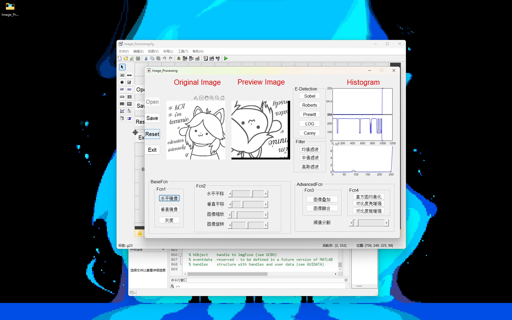

# MATLAB Image Processing Toolkit



[](https://www.mathworks.com/products/matlab.html)
[](LICENSE)

## 📋 项目简介 | Overview

基于 MATLAB GUIDE 开发的综合性图像处理工具箱，集成了经典图像处理算法与实时可视化分析功能。本项目采用模块化设计，实现了从基础几何变换到高级图像分析的完整工作流，适用于数字图像处理教学、算法验证和快速原型开发。

A comprehensive image processing toolkit developed with MATLAB GUIDE, integrating classical algorithms with real-time visualization capabilities. Features modular architecture and complete workflow from basic geometric transformations to advanced image analysis.

## 🎥 演示视频 | Demo Videos

- 🇨🇳 [Bilibili 演示](https://www.bilibili.com/video/BV1yX4y1n7Bz)
- 🌍 [YouTube Demo](https://www.youtube.com/watch?v=YJiI0nK1f4g)

## ✨ 核心特性 | Key Features

### 🎯 实时可视化系统
- **双视图对比显示**: 原始图像与处理结果并排显示
- **像素波形分析**: 实时显示图像首行像素的 RGB/灰度分量波形
- **直方图统计**: 动态更新图像灰度/颜色分布直方图
- **智能类型检测**: 自动识别彩色/灰度图像并切换对应的可视化模式

### 🔧 技术实现亮点
- 基于 MATLAB GUIDE 的图形用户界面
- 事件驱动的回调函数架构
- handles 结构体实现状态管理
- 模块化函数设计 (`gUpdate22`/`gUpdate23`)
- 支持格式: JPG, PNG, BMP, JPEG

## 🚀 功能模块 | Functional Modules

### 1️⃣ 几何变换 | Geometric Transformations

| 功能 | 实现方法 | 参数控制 |
|------|---------|---------|
| **水平/垂直镜像** | `fliplr()` / `flipud()` | 按钮触发 |
| **图像平移** | `imtranslate()` 累积偏移量 | 双滑块实时控制 |
| **图像旋转** | `imrotate()` 双线性插值 | 滑块 0-360° |
| **图像缩放** | `imresize()` 最近邻插值 + `imcrop()` | 滑块比例控制 |

**技术细节**:
- 平移功能通过增量向量 `V = [Δh, Δv]` 实现累积变换
- 旋转和缩放基于原始图像，避免累积误差
- 缩放后自动裁剪至原始尺寸，保持显示一致性

### 2️⃣ 图像滤波 | Image Filtering

#### 空间域滤波器

```matlab
% 均值滤波 - 3×3 平均模板
h = fspecial('average');

% 高斯滤波 - 8×8 窗口, σ=1.7
h = fspecial('gaussian', [8 8], 1.7);

% 中值滤波 - 分通道处理 RGB
r = medfilt2(img(:,:,1));
g = medfilt2(img(:,:,2));
b = medfilt2(img(:,:,3));
```

**应用场景**:
- **均值滤波**: 快速去噪，适合高斯噪声
- **中值滤波**: 保边去噪，适合椒盐噪声
- **高斯滤波**: 平滑图像，保留更多细节

### 3️⃣ 边缘检测 | Edge Detection

实现了五种经典边缘检测算子:

| 算子 | 原理 | 特点 |
|------|------|------|
| **Sobel** | 3×3 梯度算子 | 抗噪性好，适合实时处理 |
| **Roberts** | 2×2 交叉差分 | 计算简单，定位精确 |
| **Prewitt** | 3×3 平滑梯度 | 平滑效果好 |
| **LoG** | 拉普拉斯高斯 | 二阶导数，对噪声敏感 |
| **Canny** | 多阶段优化算法 | 精度最高，业界标准 |

**实现细节**:
- 自动将彩色图像转换为灰度图 (`rgb2gray`)
- 使用 MATLAB 内置优化的 `edge()` 函数
- 边缘检测结果为二值图像

### 4️⃣ 图像增强 | Image Enhancement

#### 对比度增强
```matlab
% 亮增强 - 扩展暗部细节
imadjust(img, [0, 0.9], [0, 1]);

% 暗增强 - 扩展亮部细节  
imadjust(img, [0.1, 1], [0, 1]);
```

#### 直方图均衡化
- 基于 `histeq()` 实现全局对比度自适应增强
- 自动重新分配灰度级，提高图像可视性
- 适用于低对比度、曝光不足的图像

### 5️⃣ 图像运算 | Image Operations

#### 图像叠加 (Weighted Addition)
```matlab
alpha = 0.5;
result = imadd(alpha * img1, alpha * img2);
```
- 加权系数 α = 0.5，实现等权混合
- 自动尺寸匹配 (`imresize`)

#### 图像融合 (Blend Fusion)
```matlab
result = imfuse(img1, img2, 'blend');
```
- 使用 MATLAB 的 `imfuse` 高级融合算法
- 支持多种融合模式

### 6️⃣ 图像分割 | Image Segmentation

**阈值分割** - 基于全局阈值的二值化
```matlab
binary = rgb2gray(img) > threshold;
```
- 滑块实时调整阈值 (0-255)
- 自动转换为灰度图后分割
- 适用于背景简单、对比度高的场景

## 🏗️ 系统架构 | System Architecture

### GUI 组件布局

```
┌─────────────────────────────────────────────────┐
│  [Open] [Save] [Reset] [Exit]                  │
├──────────────┬──────────────────────────────────┤
│              │  Control Panel                   │
│   Original   │  ├─ Geometric Transform          │
│   Image      │  ├─ Filtering                    │
│   (g11)      │  ├─ Edge Detection               │
│              │  ├─ Enhancement                   │
├──────────────┤  └─ Segmentation                 │
│   Processed  │                                   │
│   Image      │  Sliders:                        │
│   (g12)      │  - H/V Translation               │
│              │  - Rotation (0-360°)             │
├──────────────┤  - Resize (0.1-2.0×)             │
│  Waveform    │  - Threshold (0-255)             │
│  (g21, g22)  │                                   │
├──────────────┤                                   │
│  Histogram   │                                   │
│  (g23)       │                                   │
└──────────────┴──────────────────────────────────┘
```

### 状态管理机制

```matlab
handles.img   % 当前处理后的图像
handles.i     % 原始图像备份
handles.h     % 水平平移累积量
handles.v     % 垂直平移累积量
handles.file  % 文件路径
```

### 可视化更新流程

```
用户操作 → 回调函数 → 图像处理 → 更新显示
                                    ├─ 更新 g12 (处理图)
                                    ├─ 检测图像类型
                                    ├─ 调用 gUpdate22/23
                                    │   ├─ 更新波形图 (g22)
                                    │   └─ 更新直方图 (g23)
                                    └─ 保存状态 (guidata)
```

## 🔬 算法性能 | Algorithm Performance

| 操作类型 | 时间复杂度 | 空间复杂度 | 备注 |
|---------|-----------|-----------|------|
| 几何变换 | O(n) | O(n) | n = 像素总数 |
| 均值/高斯滤波 | O(n·k²) | O(k²) | k = 卷积核大小 |
| 中值滤波 | O(n·k²·log k) | O(k²) | 排序开销 |
| 边缘检测 | O(n) | O(n) | 优化实现 |
| 直方图均衡化 | O(n + L) | O(L) | L = 灰度级数 |
| 阈值分割 | O(n) | O(n) | 最快速的分割 |

## 📦 系统要求 | Requirements

### 必需环境
- **MATLAB**: R2018b 或更高版本
- **工具箱**: Image Processing Toolbox
- **操作系统**: Windows / macOS / Linux

### 推荐配置
- **内存**: ≥ 4GB RAM
- **处理器**: Intel i5 或同等性能
- **显示器**: 1920×1080 或更高分辨率

## 🚀 快速开始 | Quick Start

### 安装步骤

1. **克隆仓库**
```bash
git clone https://github.com/OlyMarco/MATLAB_Image_Processing.git
cd MATLAB_Image_Processing
```

2. **启动 MATLAB**
   - 打开 MATLAB
   - 导航到项目目录

3. **运行程序**
```matlab
cd Image_Processing
Image_Processing
```

### 使用流程

1. **加载图像**: 点击 `Open` 按钮选择图像文件
2. **应用处理**: 选择所需的图像处理功能
3. **参数调节**: 使用滑块实时调整参数
4. **查看结果**: 对比原图与处理结果，查看波形和直方图
5. **保存图像**: 点击 `Save` 按钮导出处理结果
6. **重置操作**: 点击 `Reset` 恢复到原始图像

## 📊 项目结构 | Project Structure

```
MATLAB_Image_Processing/
├── LICENSE                      # MIT 开源协议
├── README.md                    # 项目文档
├── Image_Processing/
│   ├── Image_Processing.m       # 主程序 (869 行)
│   │   ├── GUI 初始化
│   │   ├── 回调函数 (30+ 个)
│   │   ├── 可视化更新函数
│   │   └── 工具函数
│   └── Image_Processing.fig     # GUIDE 界面设计文件
└── images/
    └── main.png                 # 应用截图
```

## 🎓 技术特点 | Technical Highlights

### 设计模式
- **MVC 架构**: View (fig) + Controller (callbacks) + Model (handles)
- **事件驱动**: 基于 MATLAB 的回调机制
- **状态模式**: 使用 Enable/Visible 属性管理 UI 状态

### 代码质量
- **模块化**: 每个功能独立的回调函数
- **可复用**: 封装的可视化更新函数
- **健壮性**: 类型检测和错误警告
- **可维护**: 清晰的代码结构和注释

### 用户体验
- **渐进式启用**: 未加载图像前禁用处理功能
- **即时反馈**: 所有操作实时更新显示
- **进度指示**: 加载图像时显示进度条
- **友好提示**: 不合理操作时弹出警告对话框

## 🔮 未来展望 | Future Work

### 计划功能
- [ ] 批量处理模式
- [ ] 撤销/重做栈 (Undo/Redo)
- [ ] 更多分割算法 (Otsu, K-means, Watershed)
- [ ] 形态学操作 (腐蚀、膨胀、开闭运算)
- [ ] 频域滤波 (FFT, 频谱分析)
- [ ] 自定义卷积核编辑器
- [ ] 图像质量评估指标 (PSNR, SSIM)
- [ ] 导出处理流程为脚本

### 优化方向
- 多线程加速大图处理
- 更精细的参数调节 (输入框 + 滑块)
- 支持更多图像格式 (TIFF, RAW)
- 添加操作历史记录面板

## 📚 参考资料 | References

- Gonzalez, R. C., & Woods, R. E. (2018). *Digital Image Processing* (4th ed.)
- MATLAB Image Processing Toolbox Documentation
- Canny, J. (1986). "A Computational Approach to Edge Detection"

## 📄 许可证 | License

本项目采用 [MIT License](LICENSE) 开源协议

```
Copyright (c) 2023 Temmie
```

## 👨‍💻 作者 | Author

**Temmie** - [@OlyMarco](https://github.com/OlyMarco)

## 🙏 致谢 | Acknowledgments

感谢所有为数字图像处理领域做出贡献的研究者和工程师

---

⭐ 如果这个项目对您有帮助，请给个 Star！

💡 欢迎提交 Issue 和 Pull Request！
